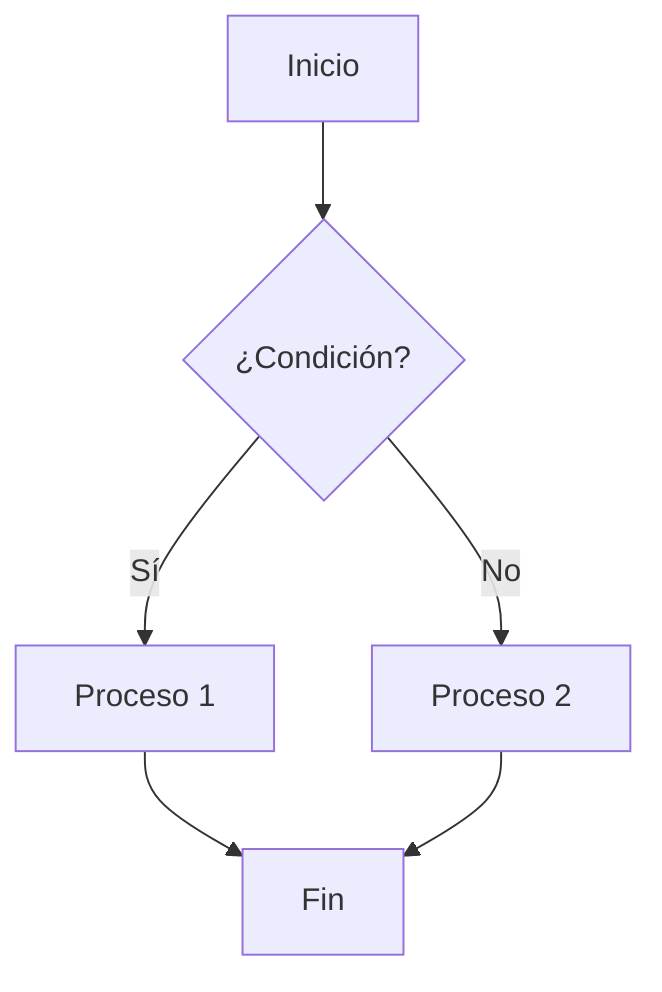
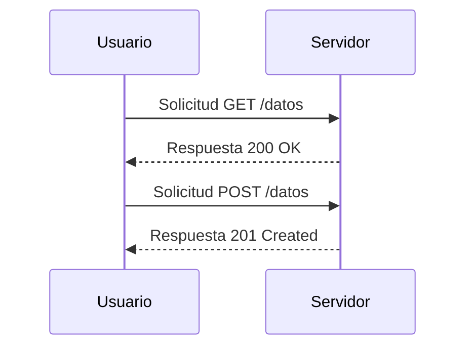
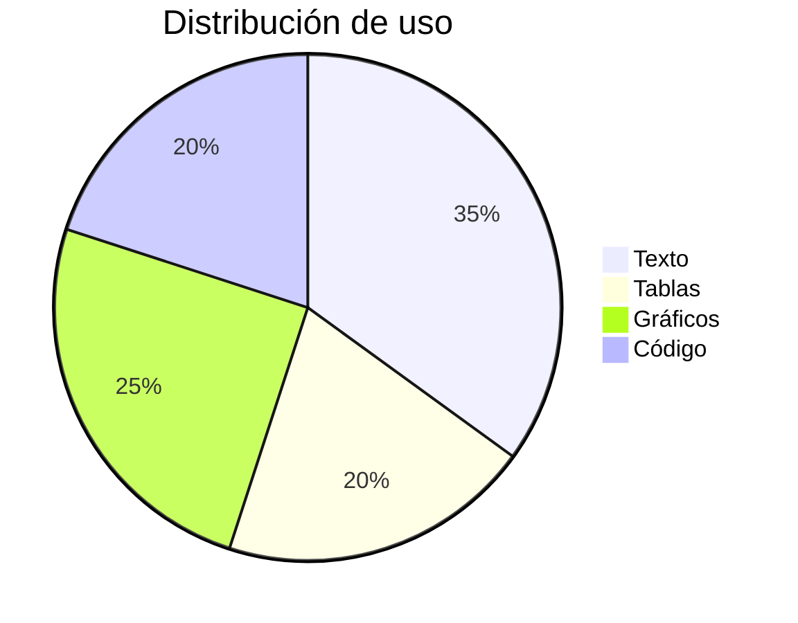

## 1. Texto y formato básico
 
Este es un párrafo con **negrita**, *cursiva*, __negrita__ y _cursiva_, ~~texto tachado~~ y `código en línea`.
 
También puede haber [enlaces](https://es.wikipedia.org/wiki/Markdown) y texto con subíndices como H~2~O o superíndices como X^2^ (dependiendo del motor de renderizado).
 
> Esto es una cita en bloque.
> Puede tener varias líneas
> y sirve para probar el estilo de blockquote.
 
---
 
## 2. Listas
 
### Lista no ordenada
- Elemento uno
- Elemento dos
  - Sub-elemento 2.1
  - Sub-elemento 2.2
- Elemento tres
### Lista ordenada
1. Primer paso
2. Segundo paso
3. Tercer paso
   1. Sub-paso 3.1
   2. Sub-paso 3.2
### Lista de tareas
- [x] Tarea completada
- [ ] Tarea pendiente
- [ ] Otra tarea pendiente
---
 
## 3. Tablas
 
| Variable | Símbolo | Unidad | Valor |
|----------|:-------:|:------:|------:|
| Velocidad de la luz | $c$ | m/s | $2.998 \times 10^8$ |
| Constante de Planck | $h$ | J·s | $6.626 \times 10^{-34}$ |
| Número de Avogadro | $N_A$ | mol⁻¹ | $6.022 \times 10^{23}$ |
| Carga del electrón | $e$ | C | $1.602 \times 10^{-19}$ |
 
**Tabla con alineación mixta:**
 
| Izquierda | Centro | Derecha |
|:----------|:------:|--------:|
| a | b | c |
| texto largo aquí | corto | 123.45 |
 
---
 
## 4. Fórmulas LaTeX
 
### En línea
La ecuación de Einstein es $E = mc^2$, y la fórmula cuadrática es $x = \frac{-b \pm \sqrt{b^2 - 4ac}}{2a}$.
 
### En bloque
 
$$
\int_{-\infty}^{\infty} e^{-x^2} \, dx = \sqrt{\pi}
$$
 
$$
\frac{\partial}{\partial t} \Psi(\mathbf{r}, t) = \frac{i\hbar}{2m} \nabla^2 \Psi(\mathbf{r}, t) - \frac{i}{\hbar} V(\mathbf{r}) \Psi(\mathbf{r}, t)
$$
 
$$
\begin{aligned}
\nabla \cdot \mathbf{E} &= \frac{\rho}{\varepsilon_0} \\
\nabla \cdot \mathbf{B} &= 0 \\
\nabla \times \mathbf{E} &= -\frac{\partial \mathbf{B}}{\partial t} \\
\nabla \times \mathbf{B} &= \mu_0 \mathbf{J} + \mu_0 \varepsilon_0 \frac{\partial \mathbf{E}}{\partial t}
\end{aligned}
$$
 
$$
A = \begin{pmatrix} 1 & 2 & 3 \\ 4 & 5 & 6 \\ 7 & 8 & 9 \end{pmatrix}
$$
 
$$
\sum_{n=1}^{\infty} \frac{1}{n^2} = \frac{\pi^2}{6}
$$
 
---
 
## 5. Código
 
Código en línea: `const x = 42;`
 
Bloque de código con resaltado de sintaxis:
 
```python
def fibonacci(n):
    a, b = 0, 1
    for _ in range(n):
        a, b = b, a + b
    return a
 
print([fibonacci(i) for i in range(10)])
```
 
```javascript
function factorial(n) {
  return n <= 1 ? 1 : n * factorial(n - 1);
}
 
console.log(factorial(5)); // 120
```
 
```sql
SELECT nombre, COUNT(*) AS total
FROM ventas
GROUP BY nombre
ORDER BY total DESC;
```
 
---
 
## 6. Imágenes
 

 
---
 
## 7. Diagramas (Mermaid)
 

 

 

 
---
 
## 8. Líneas horizontales, notas al pie y detalles
 
Texto con nota al pie[^1].
 
[^1]: Esta es la nota al pie correspondiente.
 
<details>
<summary>Haz clic para expandir</summary>
Contenido oculto dentro de un bloque colapsable, útil para probar interactividad HTML embebida en Markdown.
 
</details>
---
 
## 9. Caracteres especiales y emojis
 
Símbolos: © ® ™ § ¶ † ‡ • … « » “comillas” 'apóstrofe'
 
Emojis: 🚀 📊 ✅ ⚠️ 🔥 💡
 
---
 
*Fin del documento de prueba.*
 